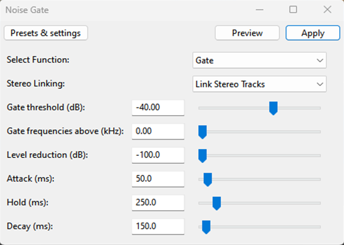
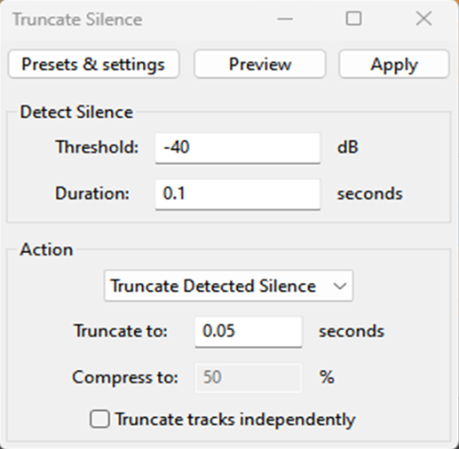
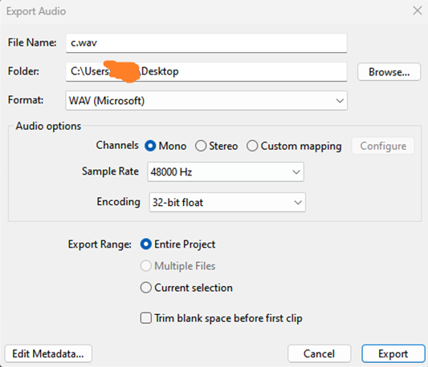

# How to create datasets

!!!info What is a Dataset?
A Dataset is a set of audio files compressed into a .zip file used by RVC for voice training.
!!!

1. First, we need to search for or download the audios of the person or character you want to create the model for

!!!info Some tips
- The audio must be in **WAV or FLAC** format and must be of good quality
- The dataset should have **a minimum duration of 10 minutes or a maximum of 30 minutes** for better results 
- Make sure your dataset has the greatest variety of tones so that the model does not struggle when imitating certain tones.
!!!

2. Now we just need to separate the vocals from the instrumental.

 - [don't know how to isolate audios?, check the audio insolation guide](/Audio\Audio.md)

3. After separating our audios, we open [Audacity](https://www.audacityteam.org/download/) to edit them and do the following:

==- Noise Gate
 Is a tool that helps reduce background noise in an audio recording, first select your audio and go to the effect section under the Steve Daulton option and select noise gate. Then set the following parameters
 
==-

==- Truncating silence
 This tool is used to remove silences from our dataset, now go back to the effect section under the special option and select truncate silence. Then set the following parameters: 
 
==-

!!!warning Before truncate silence
- The dataset should only contain speech; any other type of sound should be removed or reduced, such as hisses or breathing sounds.
!!!

4. Finally, we export our already processed audio and it’s ready for [training](/get-started\training.md/).
