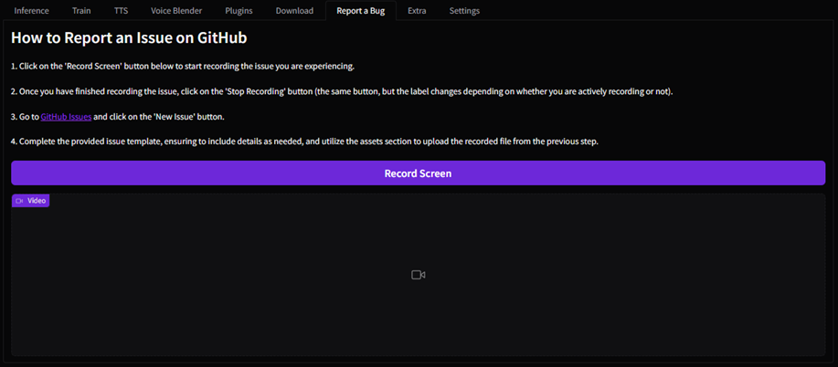

# Report an Error

- "I have an error when using Applio, is there any way to report it or find a solution?"

---

Yes, you can report a bug by going to the [issues section](https://github.com/IAHispano/Applio/issues), click on "new issues", send an image / full text of the Applio CMD and comment how you get the error (in which part, what action perform when getting the message).

You can also go to the **report a bug** section in Applio to easily record what is happening. -

---

!!! Remember to check the [FAQ section](/faq/general/errors/), there are some bugs that are still present in the current version of applio and can be found in this section. You can also go to the [Discord Server](https://discord.gg/iahispano) and share your problem in the help channels to get a direct answer!
