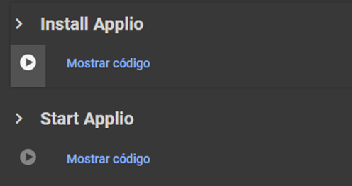

# Other Alternatives

Thanks to our team, we were able to bring Applio to other places for your convenience

+++ Google Colab UI

## What is Google Colab?

Google Colab **(Google Colaboratory)** is a free cloud based platform that enables writing and executing Python code within an interactive notebook environment. It provides free access to computing resources, including CPUs, **GPUs** and TPUs from Google’s servers, making it particularly useful for machine learning tasks and data analysis. Additionally, Colab offers a Pro subscription, but it’s not highly recommended to pay for it when there are better alternatives available. Some Colabs have an **interface (UI)** through Gradio, providing a simple and user-friendly experience for users, however, these interfaces are not allowed by Google Colab, so there is a possibility of jeopardizing your google account.

!!!warning Warning
Please note noted that Gradio is banned from Colab, so it is preferable to use a secondary, a new account or [Applio No UI Colab](https://colab.research.google.com/github/iahispano/applio/blob/master/assets/Applio_NoUI.ipynb) to avoid a possible ban. Additionally, it is possible that Colab may disconnect after a few hours due to Google’s limitations.
!!!

1. Enter [Applio Colab](https://colab.research.google.com/github/iahispano/applio/blob/master/assets/Applio.ipynb) and just **run the 2 cells**.
    

2. Due to recent issues with Gradio links, a **shared_tunnel** has been implemented. If you select this option, you’ll need to access the **shared link** and enter the **Password IP**. If you leave it unchecked, a **public link** will appear to enter the interface, in case it doesn't appear, use the other method.

    

### Extra cells (only for training)

In this section, you will find the following options:

- **Mount Drive:** Connects Colab to our Google Drive for performing backups.
- **AutoBackup:** Saves our trained model to our drive. Drive needs to be mounted first.
- **Load a Backup:** Used to load our model if we want to retrain it. Drive must be mounted.
- **Download [Custom Pretrains](https://docs.applio.org/get-started/pretrained/):** Allows direct downloading of custom pretrains to Applio.


3.  You can [train](../get-started/training.md/) models while checking [Tensorboard](../get-started/tensorboard.md), do [inference](../get-started/inferencing.md/), or use [TTS](../get-started/tts.md/)
!!!info In case you want to **train**, you should run the **Extra cells** before run **Start Applio** cell. Otherwise, simply run the **Install Applio** and **Start Applio** cells.
!!!

### How to upload my dataset in Colab?

To load your dataset in Colab, there are two ways to do it:

- Place your audio in a folder on your Google Drive, run the **Mount Drive** cell in Colab and click on :file_folder: in Colab. Then navigate to your dataset folder, copy the path, it should look like this `/content/drive/MyDrive/dataset folder` and paste it into the **dataset path**.

- Upload your audio in .wav format using the **Dataset Maker** or click on :file_folder: in Colab and setup it manually to `program/assets/datasets` creating inside a folder for the program to read it.

!!!info Mark the **Save Only Latest** option before training to prevent it from filling up your Colab storage.
!!!

### How to export my model to my Google Drive?

To save your model, there are three ways to do it:

- **Finished Model:** go to the **Export Model** section in the **Train** tab, click on the **Refresh** button and select the pth and the added index of the model to export. Finally, click on the **Upload** button, your model will be found in the **ApplioExported** folder ready to be used.

- **Model to continue training:** if you want to save all the archives of your model folder in your Drive, you just need to run the **Mount Drive** and **AutoBackup** cell before run **Start Applio** cell, your model folder will be found inside the **ApplioBackup** folder.

- **Manual (NOT RECOMENDED):** click on :file_folder: in Colab and locate the **added index** of your model in the `program/logs/model` folder, and the **.pth** files are in the `program/logs/zips` folder so you can download them. If you want to save your model folder in your Drive, you just need to cancel the **Start Applio** cell and run the **Mount Drive** cell to be able to move it to your Google Drive.

### How to resume training in Google Colab?

If the model still needs training, simply do the following:

- Run the same cells as before, but now you’ll need to enter your **model name** in **Load a backup** and run it.

- Then, in the Applio interface, input your **model name**, use the same **sample rate**, and proceed to the last part of the train tab. Set the same **[batch size](https://docs.applio.org/faq/rvc/#batch-size)**, **[pretrained](https://docs.applio.org/get-started/pretrained/#how-to-use-pretraineds) (if you used)** and increase the number of epochs you want to train.

### Code to be afk

To run this code in Colab, we have to press the keys **Ctrl + Shift + i** to open the **developer tools** option and the following window will open. In case another window is displayed, we can locate it by selecting the **Console** option, so in this way Colab will not disconnect during the separation process. First, we put **Allow pasting**, then we press enter and only then it will let us enter the code.

```js
function ClickConnect() {
  var iconElement = document.getElementById("toggle-header-button");
  if (iconElement) {
    var clickEvent = new MouseEvent("click", {
      bubbles: true,
      cancelable: true,
      view: window,
    });
    iconElement.dispatchEvent(clickEvent);
  }
}
setInterval(ClickConnect, 6000);
```
+++ Google Colab No UI

## What is Google Colab?

Google Colab **(Google Colaboratory)** is a free cloud based platform that enables writing and executing Python code within an interactive notebook environment. Some Colabs do not use **interfaces (No UI)** because their use is banned in Google Colab, which means that the entire process is done directly from the notebook using cells, making it challenging for some users.

- Enter [Applio No UI Colab](https://colab.research.google.com/github/iahispano/applio/blob/master/assets/Applio_NoUI.ipynb) and run the **Installation** cell.

### How to [infer](https://docs.applio.org/faq/rvc/#inference) in Google Colab No UI?

1. First, you’ll need to upload the audio you want to use to your Google Drive. Make sure the audio name don't contain spaces or special characters.

2. Place the **Google Drive or Hugging Face** model link in the **model_link** and run the **Download model** cell.

3. Click on :file_folder: in Colab, then navigate to your audio, copy the path, it should look like this: `/content/drive/MyDrive/audio name.wav` and paste it into the **input_path**. Finally run the **Run inference** cell.
==- **Advanced Settings**
- **Export_format:** Select the format to export the audio.
- **F0method:** Select between [rvmpe, crepe or other](https://docs.applio.org/faq/rvc/#f0-extraction-methods)
- **f0up_key:** Adjust the tone of the model, for male it is - and female it is +. For male to female is -12 and female to male is +12. 
- **Filter_radius:** Applies respiration filtering to the results, the value represents the filter radius and respiration reduction to avoid artifacts.
- **Rms_mix_rate:** Substitute or blend with the volume envelope of the output.
- **Protect:** Safeguard distinct consonants and breathing sounds to prevent electro-acoustic tearing and other artifacts.
- **Index_rate:** It is the one in charge of controlling the index, the larger the ratio, the more single the dataset but it can result in artifacts, so it is better to leave it as it is by default.
- **Hop_length:** Denotes the duration it takes for the system to transition to a significant pitch change. Smaller hop lengths require more time for inference and training but tend to yield higher pitch accuracy.
- **Clean_strenght:** The more you increase it the more it will clean up, but it will be more compressed.
- **Split_audio:** Basically cuts the audio into parts to make the inference by parts and then joins them together.
- **Clean_audio:** Clean your audio output using noise detection algorithms, recommended for speaking audios.
- **Autotune:** Apply a soft autotune to your inferences, recommended for singing conversions.
==- 

### How to train in Google Colab No UI?

1. Place your audio in a folder on your Google Drive and click on :file_folder: in Colab, then navigate to your dataset folder, copy the path, it should look like this `/content/drive/MyDrive/dataset name folder` and paste it into the **dataset_path**, make sure the audio and folder name don't contain spaces or special characters. Also, specify the [**sample rate**](https://docs.applio.org/guides/datasets/sample-rate/) and run the **Preprocess Dataset** cell.

2. Next, in the **Extract Features** section, set the [**f0method**](https://docs.applio.org/faq/rvc/#f0-extraction-methods) and **hop_length**, and run that cell.

3. Afterward, run the **Generate [index](https://docs.applio.org/faq/rvc/#added-index) file** cell.

4. In the **Train** section, before run that cell you should set the following:

  - **Total_epoch:** The number of epochs needed varies based on your dataset. Monitor progress using TensorBoard; typically, models perform well around 200-400 epochs.

  - [**Batch_size:**](https://docs.applio.org/faq/rvc/#batch-size) Adjust the batch size according to your preference; a batch size of 8 is mostly recommended.

  - **Save_every_epoch:** Set this value between 10 and 50 to determine how often the model's state is saved during training.
==- **Other Options**
- **Pitch_guidance:** Gives variation of pitch.
- **auto_backups (recomended):** Keep this checked it if you want to save a copy of your model in your Google Drive after training completes.
- [Pretrained:](https://docs.applio.org/faq/rvc/#pretrained) Uses the [RVC](https://docs.applio.org/faq/rvc/#what-is-rvc) pretrained.
- **tensorboard:** Keep this checked; it will determine if the model is overfitting.
- **Save Only Latest:** Save a single D/G file with information.
- **Save Every Weights:** Save the weights of the model when a cycle of 'Save Every Epoch' is completed.
- **Sync Graph:** Synchronize the graph of the tensorbaord. Only enable this setting if you are training a new model.
- **overtraining_detector:** Mark it only if you will train for more than 200 epochs.
- **overtraining_threshold:** Set the maximum number of epochs you want your model to stop training if no improvement is detected.
- [Custom_pretrained:](/get-started/pretrained.md) Keep this checked if you want to use the Custom Pretrained that are loaded.
==- 
- [don't know how to use Tensorboard for correct training? Check out the Tensorboard section](/get-started/tensorboard.md)

5. Finally your trained model will be located in your Google Drive within the **RVC_Backup folder**.

### How to use custom pretrained in Goggle Colab No UI?

- Download the [pretrained](https://docs.applio.org/get-started/pretrained/#where-to-find-pretraineds) you want to use and upload the d.pth and g.pth files to your Google Drive.

- Click on :file_folder: in Colab, and create a new folder named **pretrained_custom** inside the **pretraineds** folder located in **Applio/rvc/pretraineds**.

- Locate your pretrained model on your Google Drive and drag it into the newly created folder.

- Finally, copy the path of G.pth and paste it into **g_pretrained_path**, and do the same for D.pth into **d_pretrained_path**. It should look like this: `/content/Applio/rvc/pretraineds/pretraineds_custom/G48k.pth` and `/content/Applio/rvc/pretraineds/pretraineds_custom/D48k.pth`, make sure to select the sample rate according to the [sample rate](https://docs.applio.org/guides/datasets/sample-rate/#what-is-sample-rate) of the custom pretraineds.


### How to resume training in Google Colab No UI?

If the model still needs training, simply do the following:

- Run the **Installation** cell as before, but now you’ll need to enter your **model name** in **Load a backup** cell and run it.

- Then, in the **Set training variables** cell, input your **model_name**, use the same **sample_rate** and **hop_length** amd run it.

- Finally in the **Train** set the same **[batch size](https://docs.applio.org/faq/rvc/#batch-size)**, **[custom_pretrained](https://docs.applio.org/get-started/pretrained/#how-to-use-pretraineds) (if you used)**, increase the number of **total_epoch** you want to train and other seetting that you used before and run that cell.

### Code to be afk

To run this code in Colab, we have to press the keys **Ctrl + Shift + i** to open the **developer tools** option and the following window will open. In case another window is displayed, we can locate it by selecting the **Console** option, so in this way Colab will not disconnect during the separation process. First, we put **Allow pasting**, then we press enter and only then it will let us enter the code.

```js
function ClickConnect() {
  var iconElement = document.getElementById("toggle-header-button");
  if (iconElement) {
    var clickEvent = new MouseEvent("click", {
      bubbles: true,
      cancelable: true,
      view: window,
    });
    iconElement.dispatchEvent(clickEvent);
  }
}
setInterval(ClickConnect, 6000);
```
+++ Hugging Face

## What is Hugging Face?

Hugging Face is a company specialized in artificial intelligence that has distinguished itself through its work in developing tools and models for **natural language processing (NLP)**. This has made it one of the leading online communities and platforms for cutting edge NLP model research, development and distribution.

1.  First you need to create a hugging Face account.

2.  Then enter [Applio Hugging Face Space](https://huggingface.co/spaces/IAHispano/Applio) and duplicate the space, that is all. If you don't want to use hugging Face you can use [Applo playground](https://applio.org/playground).


!!!warning Warning
You can't train models here because it only utilizes CPU.
!!!
+++ Paperspace

## What is Paperspace?

Paperspace is a cloud platform that provides access to powerful virtual machines with dedicated GPU for software development, machine learning, artificial intelligence, and other applications that require substantial processing power. This has made it one of the most competent **paid** alternatives to Colab.

1. First you should create an account on [Paperspace](https://console.paperspace.com/signup)

!!!info During the account creation

- You will be asked for account verification, so you will need to enter a phone number and input the received verification code.
- You should know that Paperspace’s **free** plan is quite poor, and there’s nothing you can do about it. So, you should consider paying for a **Pro** or **Growth** plan.
- Paperspace has joined **DigitalOcean**, so you can also pay with PayPal or Google Pay!.
- You can pay by the hour for a [dedicated GPU](https://www.paperspace.com/pricing) instead of using the default free ones or the paid plan.
- You will need to clarify some additional account details before starting to use Paperspace.
  !!!

2. Once the account is created, you will need to choose a Paperspace plan. To do this, click on **Upgrade** and select the one that suits your preference. The best option is the **Pro** plan.

3. Go to the **Gradient** tab and click on the **Create** button:

- Select the template: **Start from Scratch**
- Select a avaible **GPU**
- Select the number of hours your computer will remain active.
  Then click on **Start Notebook**.

4. Now type the following commands one at a time in the terminal; this is only for the first time:

```js
git clone https://github.com/IAHispano/Applio.git
cd /notebooks/Applio
make run-install
make run-applio
```

- **Next time, you will only enter the last 3 commands**.

5. Finally, the link to access the **GUI** will appear.

6. You can [train](/get-started/training.md/) models while checking [Tensorboard](/get-started/tensorboard.md), do [inference](/get-started/inferencing.md/), or use [TTS](/get-started/tts.md/)

### How to upload my dataset in Paperspace?

Upload your audio in .wav format using the **Dataset Maker** or click on :file_folder: and setup it manually to `Applio/assets/datasets` creating inside a folder for the program to read it.
!!!info Mark the **Save Only Latest** option before training to prevent it from filling up your storage.
!!! 
7. Run tensorboard in another terminal, click on :icon-terminal: and enter the following commands:

```js
cd /notebooks/Applio
make run-tensorboard
```

8. Click on :file_folder: and locate your trained model in the `Applio/logs/model` folder, and the .pth files are in the `Applio/logs/zips` folder.

### How to resume training in Paperspace?

If the model still needs training, simply do the following:

- Entering the last 3 commands from step 4.

- Then, in the Applio interface, input your **model name**, use the same **sample rate**, and proceed to the last part of the train tab. Set the same **[batch size](https://docs.applio.org/faq/rvc/#batch-size)**, **[pretrained](https://docs.applio.org/get-started/pretrained/#how-to-use-pretraineds) (if you used)** and increase the number of epochs you want to train.

!!!warning Warning
Make sure to set the [batch size](https://docs.applio.org/faq/rvc/#batch-size) according to the VRAM of your chosen GPU.
!!!
+++
