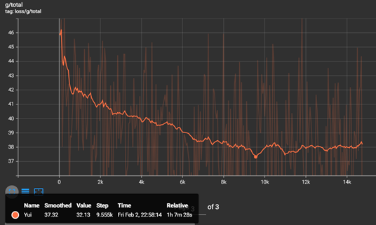

# Tensorboard

Tensorboard is a series of graphs where we can monitor the progress of our model during training, but there are many graphs. We are only interested in the graph called 'g/total'. You can find this by clicking on 'inactive' and selecting 'scalars'. Then, go to the last page, where you will find it in the last graph.

## How tu use it?
1. Open TensorBoard by running the following command in your terminal or use the run-tensorboard.bat file:

   ```
   tensorboard --logdir=path/to/your/logs
   ```

   Replace "path/to/your/logs" with the actual path to your TensorBoard logs.

2. Once TensorBoard is running, open your web browser and navigate to `http://localhost:6006` (or the address indicated in your terminal).

3. Click on the "Scalars" tab in TensorBoard.

4. Look for the "g/total" metric at the top to monitor the progress of your training.


This image provides a visual guide for locating the "g/total" metric within the "Scalars" tab.

!!!info Settings
- Set the **smoothing** to 0.950 or 0.987 for a better view of the graph. 
- You can click on the :gear: to mark the option to **reload data** every 30 seconds. 
- Below each graph, there will be 3 buttons. The first one is to **put it in full size**, the second one is to **deactivate the Y-axis** and the last one is to **adjust the data to the graph**. 
- Uncheck the option to **ignore outliers in chart scaling**.
!!!

## Lowest Point
It’s when the graph goes to a point so low that it doesn’t happen again. During training, there will be several low points which you should test to find the indicated pth of your model and in this way prevent our model from being [overtrained](https://docs.applio.org/faq/rvc/#overtraining). To know which one to choose, we go to the lowest point and look at how many **steps** it has. Knowing this, we can search in the open cmd or colab notebook for the epochs with that step or the closest one from the save points.
--

==- Advanced Information
Besides checking the loss/g/total, it’s necessary to monitor the loss/g/mel, loss/g/kl and loss/d/total graphs. If any of these values increase and don’t decrease again, it indicates [overtraining](https://docs.applio.org/faq/rvc/#overtraining). Following this, we will explain more details about these and some parts of TensorBoard:

### Scalars:
- **`loss/g/total`**:  The total generator loss. This measures how well the generator is able to fool the discriminator and produce realistic-sounding audio.  A lower value is generally better.
- **`loss/d/total`**: The total discriminator loss.  This loss reflects how well the discriminator can differentiate between real and generated audio. A higher value usually indicates a well-performing discriminator. 
- **`learning_rate`**:  The current learning rate of the optimizers for both the generator and discriminator. This value will typically decrease over time as defined by the learning rate scheduler.
- **`grad_norm_d`**: The gradient norm for the discriminator.  A measure of the magnitude of gradients during training. It helps monitor if the gradients are becoming too large (potentially causing instability) or too small (potentially leading to slow learning).
- **`grad_norm_g`**:  The gradient norm for the generator. Similar to `grad_norm_d`, this measures the magnitude of gradients for the generator.
- **`loss/g/fm`**: The feature matching loss.  This loss encourages the generator to produce audio that matches the feature maps extracted by the discriminator, promoting similar acoustic characteristics between real and generated audio.
- **`loss/g/mel`**: The Mel-spectrogram loss.  This loss measures the difference between the Mel-spectrogram of the generated audio and the target Mel-spectrogram. A smaller value indicates a better match in spectral characteristics.
- **`loss/g/kl`**: The Kullback-Leibler (KL) divergence loss. This loss measures the difference between the distributions of the latent variables generated by the encoder and the posterior encoder. A lower value indicates better alignment between these distributions, contributing to a more stable and controllable model.
- **`loss/g/{i}`**:  Individual generator losses for each discriminator output.  These losses provide a more detailed breakdown of the generator's performance at different temporal scales.
- **`loss/d_r/{i}`**: Individual discriminator losses for real audio at each discriminator output.  These losses show how well the discriminator is performing on real audio at different scales.
- **`loss/d_g/{i}`**: Individual discriminator losses for generated audio at each discriminator output. These losses indicate the discriminator's ability to distinguish generated audio from real audio at various temporal scales.

### Images:
- **`slice/mel_org`**:  A visualization of the Mel-spectrogram of the target audio segment.
- **`slice/mel_gen`**: A visualization of the Mel-spectrogram of the generated audio segment. 
- **`all/mel`**: A visualization of the Mel-spectrogram of the entire target audio.

### Interpretation:
- **General Trend:** Look for a decreasing trend in the generator's total loss (`loss/g/total`) and a relatively stable or increasing trend in the discriminator's total loss (`loss/d/total`) over time.
- **Gradient Norm:** Monitor the gradient norms to ensure they don't become excessively large or small.
- **Loss Components:** Analyze individual loss components (e.g., `loss/g/mel`, `loss/g/kl`) to understand how specific aspects of the model are performing.
- **Mel-Spectrograms:**  Compare the Mel-spectrogram images (`slice/mel_org` and `slice/mel_gen`) to visually assess the quality of the generated audio.
==-
