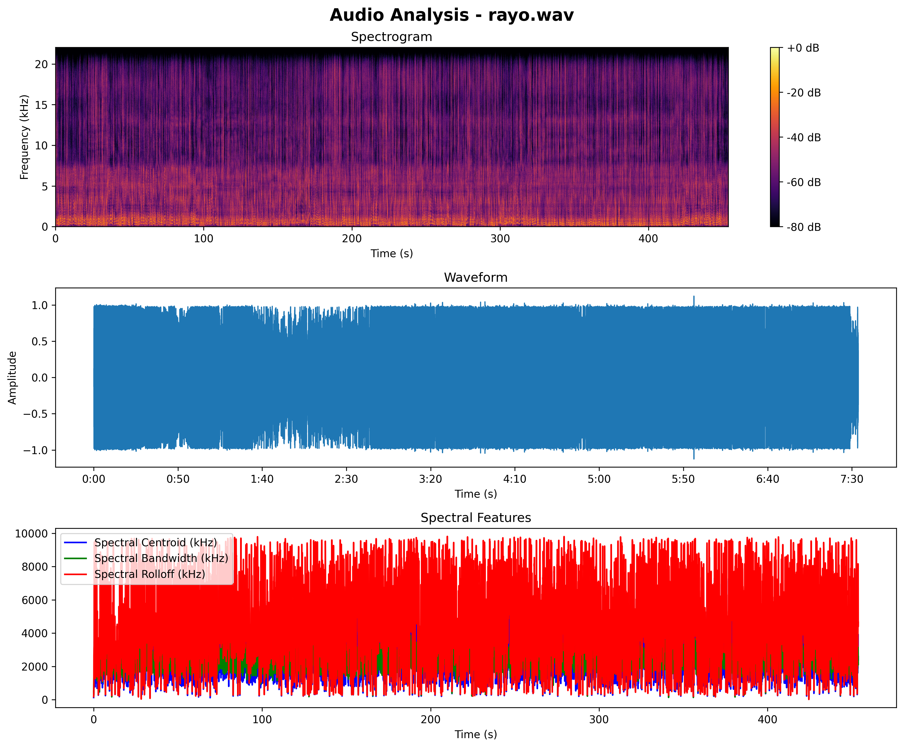

# Sample Rate
Here you will learn how to see the sampling frequency of an audio.

## What is sample rate?
Basically, it’s the frequency that our audio can reach, which is measured in KHz. If you choose an incorrect sample rate to train a type of sound unrelated to the voice, it can result in a poor model.

1. To do this, we need the program [Spek](https://www.spek.cc/p/download). If you have Applio installed on your PC, you can check the [audio analyzer](/get-started/audio-analyzer.md/) section.

2. Drag your dataset into the program, and you’ll get the following image and information:
     - Sample rate
     - Duration of the audio
     - Number of Samples
     - Bits per Samples
     - Channels (Mono or Stereo)

 

3. Now that we’ve seen in the **Spectrogram** image that our audio has an audio frequency of 22050 KHz, we multiply it by two, and we would have our sample rate.

!!!info Info
In case you get a frequency like 44100k, you should choose the one that is closest to that frequency.
!!!