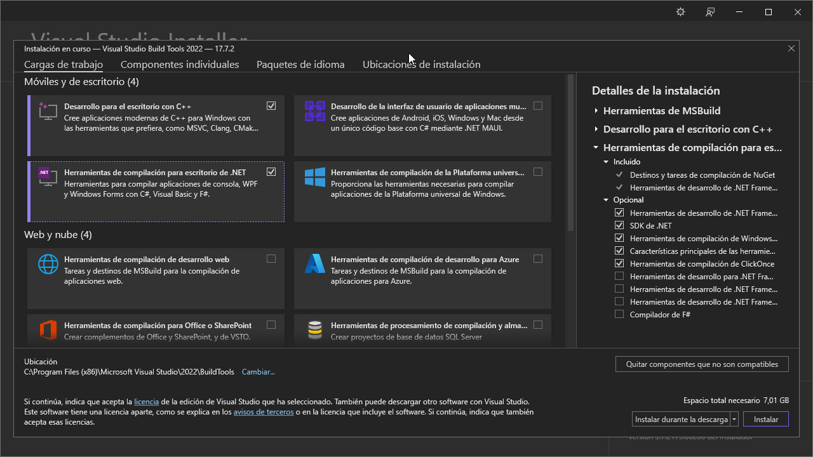

# How to check if the Visual Studio Build Tools are installed correctly

If you are having problems with the installation of the Visual Studio Build Tools, you can check if they are installed correctly by following these steps:

1. Open the Visual Studio Installer (If you don't have it installed, you can download it from [here](https://aka.ms/vs/17/release/vs_BuildTools.exe)):

2. Check if you have this screen (or similar with another version):

2.1 If you don't have it installed, go to the available tab, click on the install button in the "Visual Studio Build Tools 2022" and then click on this icons: "Desktop development with C++" and the ".NET Desktop Buildtools":

3. If you have this screen, check clicking on the "Modify" button and check if the "Desktop development with C++" and the ".NET Desktop Buildtools" option is selected if theay aren't click them and click on the "Install" button:

