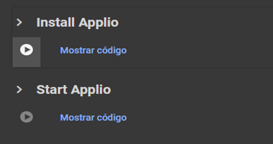
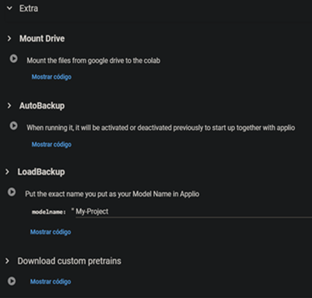
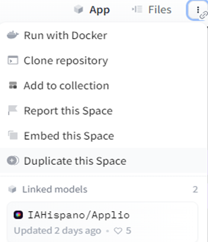

# Other Alternatives
Thanks to our team, we were able to bring Applio to other places for your convenience

+++ Google Colab
 !!!warning Warning
 It should be noted that Gradio is banned from Colab, so it is preferable to use a secondary or new account to avoid a possible ban. Additionally, it is possible that Colab may disconnect after a few hours due to Google’s limitations.
 !!!
 1. Enter [Applio Colab](https://colab.research.google.com/github/iahispano/applio/blob/master/assets/Applio.ipynb) and just **run the 2 cells**. 
 

 2. Then a **public link** will be given to us where we can enter the interface.

 ### Extra cells
 In this section, you will find the following options:

 - **Mount Drive:** Connects Colab to our Google Drive for performing backups.
 - **AutoBackup:** Saves our trained model to our drive. Drive needs to be mounted first.
 - **Load a Backup:** Used to load our model if we want to retrain it. Drive must be mounted.
 - **Download [Custom Pretrains](https://docs.applio.org/get-started/pretrained/):** Allows direct downloading of custom pretrains to Applio.

 

 3. You can [train](/get-started\training.md/) models while checking [Tensorboard](/get-started\tensorboard.md), do [inference](/get-started\inferencing.md/), or use [TTS](/get-started\tts.md/)

 !!!info In case you want to **train**, you should run the **Extra cells** before run **Start Applio** cell. Otherwise, simply run the **Install Applio** and **Start Applio** cells.
 !!!

 ### How to upload my dataset in Colab?
 To load your dataset in Colab, there are two ways to do it:

 - Place your audio in a folder on your Google Drive, run the **Mount Drive** cell in Colab and Click on :file_folder: in Colab. Then navigate to your dataset folder, copy the path, it should look like this `/content/drive/MyDrive/dataset folder` and paste it into the **dataset path**.

 - Upload your audio in .wav format using the **Dataset Maker** or click on :file_folder: and setup it manually to `program/assets/datasets` creating inside a folder for the program to read it.

 !!!info Mark the **Save Only Latest** option to prevent it from filling up your Colab storage.
 !!!
 4. Your trained model is located in the logs/model folder, and the .pth files are in the logs/zips folder. If you want to save your model folder in your Drive, you just need to run the **Mount Drive** and **AutoBackup** cell before run **Start Applio** cell.

 -  (If you want to retrain place the name of your model in the **Load a Backup** cell and run it. Then, insert the name of your model and enter a higher number of epochs.)
+++ Huggingface
 1. First you need to create a huggingface account.

 2. Then enter [Applio Huggingface Space](https://huggingface.co/spaces/IAHispano/Applio) and duplicate the space, that is all. If you don't want to use huggingface you can use  [Applo playground](https://applio.org/playground).
 
 
 
 !!!warning Warning
 You can't train models here.
 !!!
+++ Paperspace
## What is Paperspace?
Paperspace is a cloud platform that provides access to powerful virtual machines with dedicated GPU for software development, machine learning, artificial intelligence, and other applications that require substantial processing power. This has made it one of the most competent **paid** alternatives to Colab.

1. First you should create an account on [Paperspace](https://console.paperspace.com/signup)

!!!info During the account creation
- You will be asked for account verification, so you will need to enter a phone number and input the received verification code.
- You should know that Paperspace’s **free** plan is quite poor, and there’s nothing you can do about it. So, you should consider paying for a **Pro** or **Growth** plan.
- Paperspace has joined **DigitalOcean**, so you can also pay with PayPal or Google Pay!.  
- You can pay by the hour for a [dedicated GPU](https://www.paperspace.com/pricing) instead of using the default free ones or the paid plan.
- You will need to clarify some additional account details before starting to use Paperspace.
!!!

2. Once the account is created, you will need to choose a Paperspace plan. To do this, click on **Upgrade** and select the one that suits your preference. The best option is the **Pro** plan.

3. Go to the **Gradient** tab and click on the **Create** button:
 - Select the template: **Start from Scratch**
 - Select a avaible **GPU**
 - Select the number of hours your computer will remain active. 
   Then click on **Start Notebook**.

4. Now type the following commands one at a time in the terminal; this is only for the first time:

``` js
git clone https://github.com/IAHispano/Applio.git
cd /notebooks/Applio
make run-install
make run-applio
```
- **Next time, you will only enter the last 3 commands**.

5. Finally, the link to access the **GUI** will appear.

6. You can [train](/get-started\training.md/) models while checking [Tensorboard](/get-started\tensorboard.md), do [inference](/get-started\inferencing.md/), or use [TTS](/get-started\tts.md/)

7. Run TensorBoard in another terminal, click on :icon-terminal: and enter the following commands:
``` js
cd /notebooks/Applio
make run-tensorboard
```
!!!warning Warning
Make sure to set the [batch size](https://docs.applio.org/faq/rvc/#batch-size) according to the VRAM of your chosen GPU.
!!!
+++ 