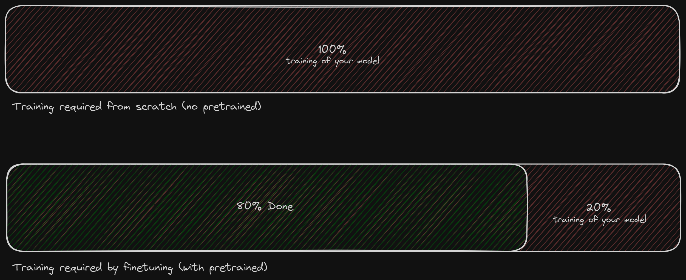
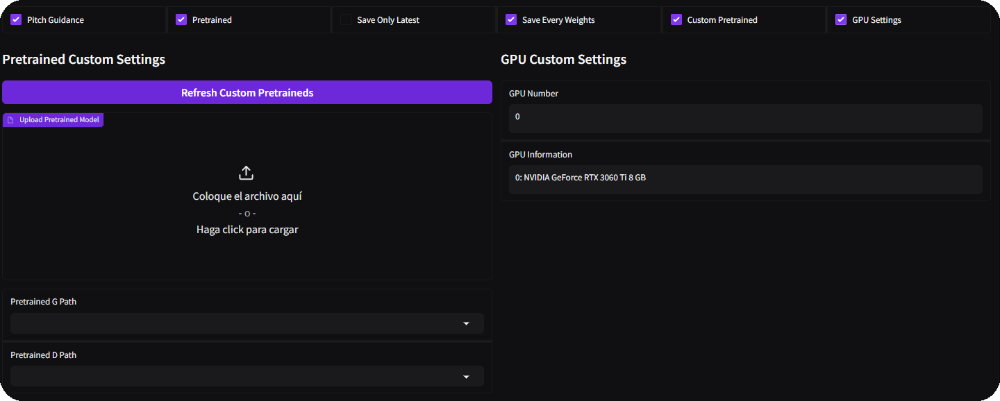

# Pretrained

## What are pretraineds?

When it comes to training, you have two main options: building a model from the ground up or fine-tuning an already existing one. These pre-trained models are designed to streamline your training process, saving time and enhancing the overall quality of your results.

_Simply put, the image illustrates that having a pre-trained model saves you effort during subsequent model training._

## How to create pretraineds?

When creating a pretrained model, you have two primary options to consider.

Firstly, you can either initiate a fine-tuning process on another pretrained model, which could be one of the originals, or start building one from scratch.

Should you opt for building from scratch, the ideal approach involves gathering a substantial amount of moderately clean data; it doesn't necessarily have to be perfectly pristine. Subsequently, fine-tune this model with high-quality data.

An essential consideration is to construct datasets devoid of copyrighted material.

Alternatively, if you choose to fine-tune a pretrained model, the crux lies in the quality of the audio inputs. You can tailor it to a specific language, incorporate diverse speakers, and even integrate various accents. The customization possibilities are vast. However, it's crucial to strike a balance; avoid overtraining the pretrained model. The more effectively you fine-tune it now, the less training it will necessitate later during usage.

To embark on building a model from scratch, conduct standard training while disabling the Pretrained option. For fine-tuning, engage in ordinary training while loading the desired pretrained model to fine-tune it.

## How to use pretraineds?

In the training tab, check the **'Custom Pretrained'** box, upload the files, and select it in the **Pretrained G/D Path boxes**.

## Where to find pretraineds?

### Ov2 Super by SimplCup

Works well for small and English datasets. Additionally, it allows models to train with very few epochs compared to regular pretrains. This only supports **32k and 40k** sample rates.

> https://huggingface.co/ORVC/Ov2Super/tree/main

### RIN E3 by Mustar

Yields good results with clean and English datasets, but it is more sensitive to noise. This only supports **40k** sample rate.

> https://huggingface.co/MUSTAR/RIN_E3/tree/main

### SnowieV3 by Mustar

Works well with Russian datasets and also helps models of other languages to pronounce Russian well. Supports **all the sample rates**.

> **32k**: https://huggingface.co/MUSTAR/SnowieV3.1-32k/tree/main

> **40k**: https://huggingface.co/MUSTAR/SnowieV3.1-40k/tree/main

> **48k**: https://huggingface.co/MUSTAR/SnowieV3.1-48k/tree/main

### SnowieV3 X RIN_E3 by Mustar

Works well with Russian or Japanese language datasets and also helps models of other languages to pronounce Russian or Japanese well. This only supports **40k** sample rate.

> https://huggingface.co/MUSTAR/SnowieV3.1-X-RinE3-40K/tree/main

### KLM v7 by SeoulStreamingStation

Works well with Korean and some types of Japanese voices. Unlike typical pre-trained models, it has a very wide vocal range, which should be very helpful for those covering songs, this only supports **32k** sample rate.

> https://huggingface.co/SeoulStreamingStation/KLMv7s/resolve/main/KLMv7s_32k.zip

Make sure to select the sample rate according to the [sample rate](https://docs.applio.org/guides/datasets/sample-rate/#what-is-sample-rate) of the custom pretraineds.