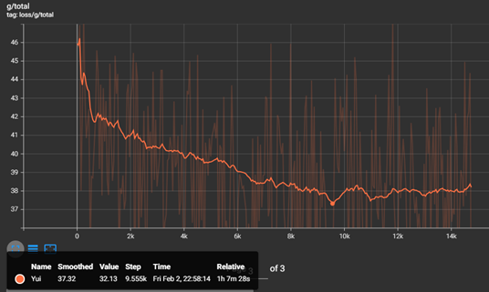

# Tensorboard

Tensorboard is a series of graphs where we can monitor the progress of our model during training, but there are many graphs. We are only interested in the graph called 'g/total'. You can find this by clicking on 'inactive' and selecting 'scalars'. Then, go to the last page, where you will find it in the last graph.

## How tu use it?
1. Open TensorBoard by running the following command in your terminal or use the run-tensorboard.bat file:

   ```
   tensorboard --logdir=path/to/your/logs
   ```

   Replace "path/to/your/logs" with the actual path to your TensorBoard logs.

2. Once TensorBoard is running, open your web browser and navigate to `http://localhost:6006` (or the address indicated in your terminal).

3. Click on the "Scalars" tab in TensorBoard.

4. Look for the "g/total" metric at the top to monitor the progress of your training.


This image provides a visual guide for locating the "g/total" metric within the "Scalars" tab.

!!!info Settings
- Set the **smoothing** to 0.950 or 0.987 for a better view of the graph. 
- You can click on the :gear: to mark the option to **reload data** every 30 seconds. 
- Below each graph, there will be 3 buttons. The first one is to **put it in full size**, the second one is to **deactivate the Y-axis** and the last one is to **adjust the data to the graph**. 
- Uncheck the option to **ignore outliers in chart scaling**.
!!!

## Lowest Point
It’s when the graph goes to a point so low that it doesn’t happen again. During training, there will be several low points which you should test to find the indicated pth of your model. To know which one to choose, we go to the lowest point and look at how many **steps** it has. Knowing this, we can search in the open cmd for the epochs with that step or the closest one from the save points.
--

==- Advanced Information
Besides checking the loss/g/total, it’s necessary to monitor the loss/g/mel, loss/g/kl and loss/d/total graphs. If any of these values increase and don’t decrease again, it indicates overtraining.
==-