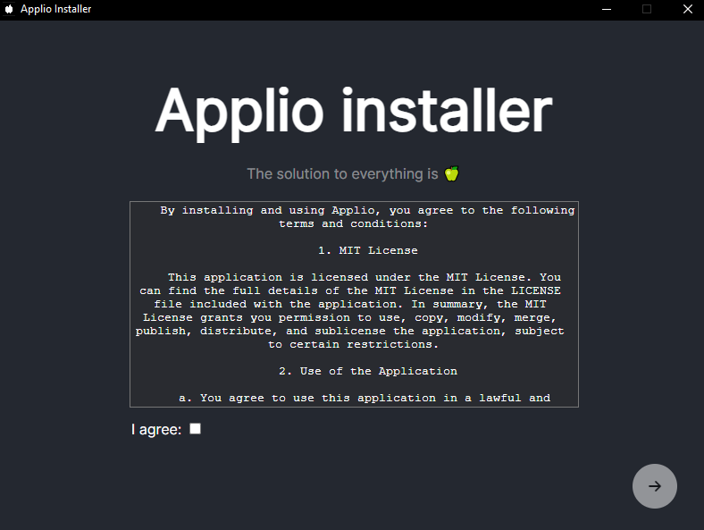
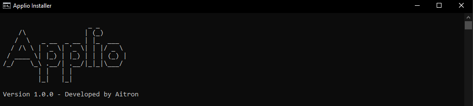
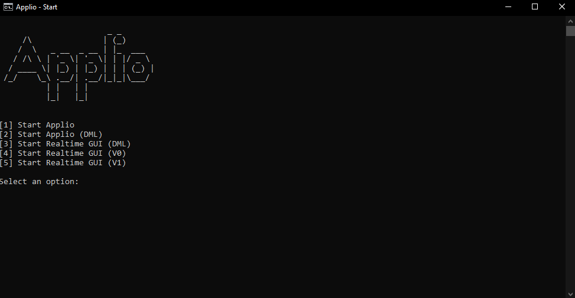

# Installation

!!!warning Requirements
[Go to this page ](/requirements) and install all the requirements needed
!!!

### Automatic installation:

To quickly and effortlessly install Applio along with all the necessary models and configurations on Windows.

+++ Only NVDIA
If you have a nvdia graphics card use the [Applio_Installer.exe](https://github.com/IAHispano/Applio-RVC-Fork/releases) available in the releases section.

+++ NVDIA, AMD or Intel
If you have another graphics card or the first option is not working use the [install_Applio.bat](https://github.com/IAHispano/Applio-Installer/releases) available in the releases section.

+++

### Manual installation:

1. Clone the repository

```bash
git clone https://github.com/IAHispano/Applio-RVC-Fork
```

2. Install dependencies (Python 3.9.8):
   +++ NVDIA

```bash
pip install -r ../assets/requirements/requirements.txt
```

+++ AMD or Intel

```bash
pip install -r ../assets/requirements/requirements-dml.txt
```

+++ Intel Arc

```bash
pip install -r ../assets/requirements/requirements-ipex.txt
```

+++

### Paperspace:

```bash
cd Applio-RVC-Fork
make install # Do this everytime you start your paperspace machine
```

### Run Applio

+++ Script
Open the go_Applio.bat script and select the option you prefer

+++ Manually
NVDIA:

```bash
python infer-web.py --pycmd python --port 7897
```

AMD or Intel:

```bash
python infer-web.py --pycmd python --port 5000 --dml
```

+++
