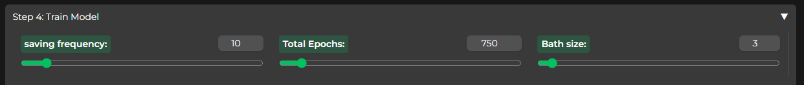
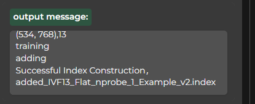

## Training a Model

Training a model in Applio is a straightforward process. Follow these steps to create and train your model effectively:

### Step 1: Dataset Preparation

1. Create a folder with your preferred name inside `Applio-RVC-Fork/datasets/`.

2. Upload the audio files you intend to use for training into this folder.

### Step 2: Dataset Processing

1. Open Applio and start by naming your model.

2. Click `Refresh Dataset List` in the interface.

3. Select the folder you created in Step 1.

4. Execute the `Process Data` step and continue until you see the `End Preprocess` output message.

### Step 3: Feature Extraction

1. Choose the desired feature extraction method that suits your needs.

2. Execute the `Extract Features` step.

3. Wait for the `All-Feature-Done` message to confirm the completion of feature extraction.

### Step 4: Model Training

1. Configure the training parameters based on your requirements.

   

   - **Save Frequency:** Set this value between 10 to 50. It determines how often the model's state is saved during training. This helps in reverting to a previous point if overtraining occurs.

   - **Training Epochs:** The number of epochs needed varies based on your dataset. Choose a value that seems appropriate and monitor progress using TensorBoard. Typically, models start performing decently at around 100-200 epochs.

   - **Batch Size:** Adjust the batch size based on your graphics card's VRAM. For instance, if you have 8GB VRAM, use a batch size between 6-8. Consider your graphics card's CUDA cores when experimenting with higher batch sizes.

2. Click the `Train Model` button to initiate training.

3. Monitor the progress in the Applio console as each epoch forms.

### Final Step: Model Saving and Index File Generation

1. Once the model training is complete, generate the index file by clicking the "Train Feature Index" button.

2. If done correctly, it should resemble the example below:

   

3. To save your model, select a preferred saving method and click the corresponding button. The zip file containing your model will be located inside the `Applio-RVC-Fork/logs/finished/`.