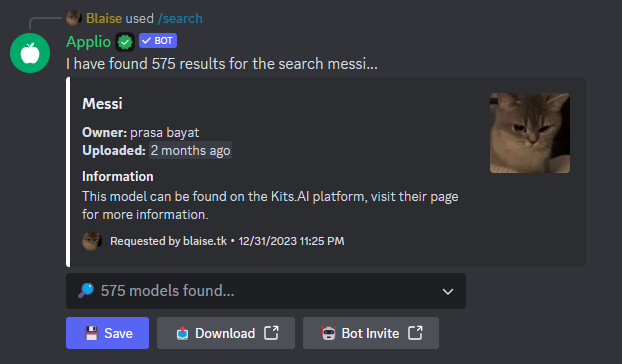

# Applio Bot

The bot is capable of searching models within a database of over +500k functional RVC voice models, consider using Applio Bot. It offers the convenience of collecting models from multiple servers and provides an easy to use interface.

## Invitation

[!button variant="success" icon="copilot" text="Applio Bot"](https://discord.com/oauth2/authorize?client_id=1144714449563955302&permissions=2147871809&scope=bot)

## How to use Applio Bot

Type the command /search, enter the model name you want to search for and the type of technology you want **RVC or Kits.AI** and you’re done.

